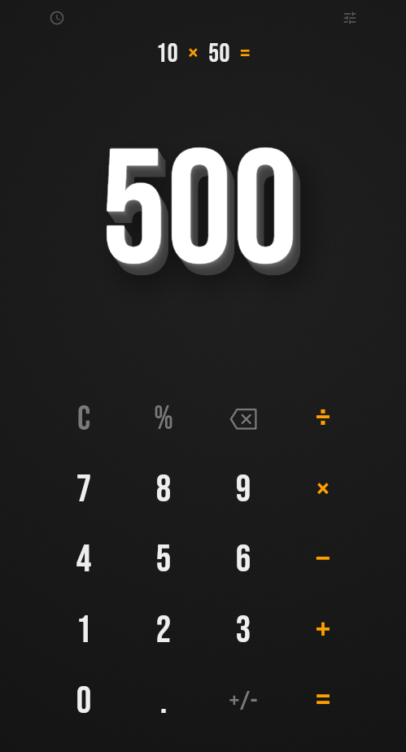
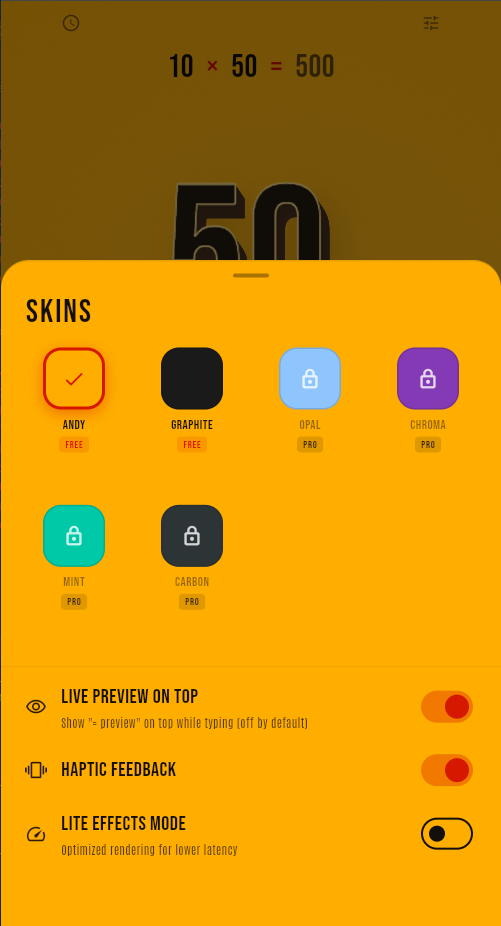
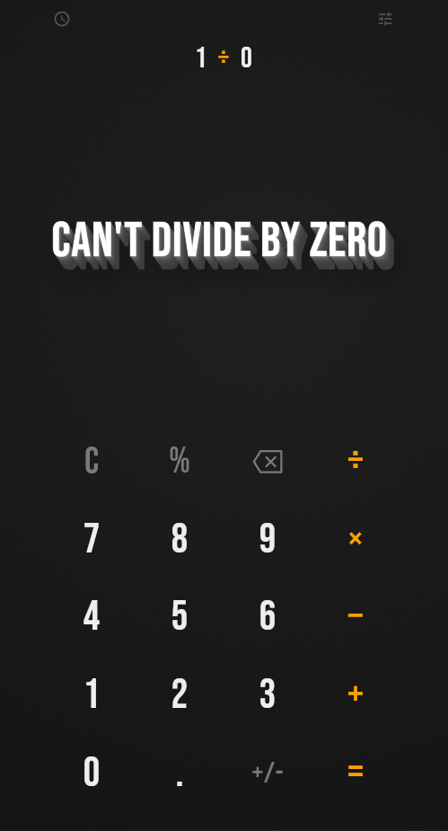
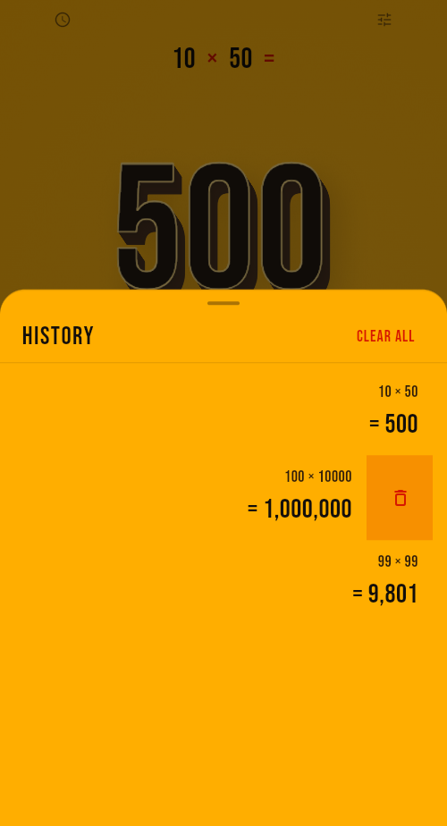

# Pop Calc

> **Math, but make it physical.**
> A calculator with extruded 3D numerals, tactile motion, and a design worth opening every day.

Built with Flutter · Android-first · 100% offline · Zero data collected

---

<table>
  <tr>
    <td align="center"></td>
    <td align="center"></td>
  </tr>
  <tr>
    <td align="center"></td>
    <td align="center"></td>
  </tr>
</table>

---

## Graphite Theme

Graphite is Pop Calc's signature dark skin — deep slate black with crisp white numerals and punchy amber-orange operators.

| Token | Value | Role |
|---|---|---|
| `bg` | `#141414` | Deep slate black background |
| `bgShade` | `#1F1F1F` | Subtle panel gradient |
| `ink` | `#EEEEEE` | Crisp white numerals and keys |
| `inkSoft` | `#7A7A7A` | Muted grey utility keys (C, %, ⌫) |
| `accent` | `#FFA000` | Amber orange operators and equals |
| `extrudeTop` | `#FFFFFF` | 3D numeral front face |
| `extrudeSide` | `#3C3C3C` | Slate-grey depth wall |
| `extrudeShadow` | `#00000099` | Soft ambient contact shadow |
| `extrudeChamfer` | `#FFFFFF50` | Bevel highlight rim on numeral edges |

The numerals are rendered using a layered extrusion technique: 10–16 stacked `TextPainter` passes offset along an oblique vector, topped with a chamfer-highlight stroke that reads as a physical, sculpted edge. A Gaussian ambient shadow grounds the stack. In **Lite Effects** mode this drops to 4 layers with no blur for smooth performance on low-end devices.

---

## Customization

Pop Calc ships with **two free skins** and unlocks more with a single one-time Pro purchase — no subscriptions, no locked math.

### Free skins

| Skin | Background | Accent | Style |
|---|---|---|---|
| **Andy** | `#FFAE00` Golden marigold | `#D61800` Vermilion red | Sunny, high-energy |
| **Graphite** | `#141414` Deep slate | `#FFA000` Amber orange | Dark, sculpted |

### Pro skins (unlocked via one-time purchase)

| Skin | Vibe |
|---|---|
| **Opal** | Pale sky blue on near-black |
| **Chroma** | Deep violet with neon accent |
| **Mint** | Fresh teal on dark green |
| **Carbon** | Neutral mono with charcoal depth |

### Settings

| Setting | Default | Description |
|---|---|---|
| **Live Preview on Top** | Off | Shows the computed result above the expression while typing |
| **Haptic Feedback** | On | `selectionClick` per key · `mediumImpact` on `=` · `heavyImpact` on error |
| **Lite Effects Mode** | Off | Drops extrusion to 4 layers and disables Gaussian blur for low-end devices |

All cosmetic. Nothing needed to do math is ever locked.

---

## Logical Explanation

Pop Calc uses **decimal arithmetic** (not binary floating point), so `0.1 + 0.2` shows `0.3`.

### Order of operations

Standard algebraic precedence: multiply and divide are evaluated before add and subtract. Within the same precedence level, evaluation is left-to-right.

```
1 + 2 × 3   →   7        (not 9)
8 / 4 + 2   →   4
```

### Percent semantics

Pop Calc follows the convention of mainstream phone calculators, where `%` is context-sensitive:

| Input | Interpretation | Example | Result |
|---|---|---|---|
| `a + b%` | `a + (a × b / 100)` | `1024 + 5%` | `1075.2` |
| `a − b%` | `a − (a × b / 100)` | `200 − 15%` | `170` |
| `a × b%` | `a × (b / 100)` | `80 × 25%` | `20` |
| `a ÷ b%` | `a ÷ (b / 100)` | `50 ÷ 25%` | `200` |
| `b%` alone | `b / 100` | `12%` | `0.12` |

### Edge cases

| Case | Behaviour |
|---|---|
| Divide by zero | Shows **"Can't divide by zero"** with a horizontal shake and heavy haptic. Expression stays editable. |
| Consecutive operators | Latest operator replaces the previous one |
| Leading zeros | `007` collapses to `7` |
| Multiple decimals | Second decimal point in a number is ignored |
| Very large results | Scientific notation (`1.2345e15`) beyond 15 significant digits |
| Trailing zeros | Trimmed — `2.50` displays as `2.5` |
| Negative numbers | `+/−` toggles sign of the current term |

### Expression line

Sits above the giant result, right-aligned at 24 sp. Operators are tinted in the skin's accent color; the active term in full ink. The result updates live at 60% opacity while typing. Pressing `=` triggers the **result morph**: font weight animates from 200 → 700 over 420 ms (`easeOutCubic`) as depth rises from 0 → 1.

---

## History

The history sheet slides up as a modal bottom sheet — the calculator stays in context.

- **Capacity:** Last 50 calculations (Pro: unlimited, with search and pin)
- **Tap** any entry to restore its result into the main display
- **Swipe left** to delete a single entry
- **Clear All** removes the full list
- Entries are right-aligned: expression on top, `= result` in large bold type below

History is stored locally on-device. No sync, no cloud, no account required.

---

## Architecture

```
lib/
├── core/
│   ├── theme/          # ThemeColors tokens, AppThemeMode enum
│   └── ...
└── features/
    ├── calculator/
    │   ├── domain/     # Expression parser, percent resolver, decimal engine
    │   ├── data/       # History repository (local storage)
    │   └── presentation/
    │       └── widgets/
    │           └── extruded_number.dart   # ExtrudedNumberPainter (CustomPainter)
    └── settings/       # Skin picker, Pro unlock, toggle prefs
```

Built with **Flutter** · State managed via **Riverpod** · Decimal math via `decimal` package · Haptics via `flutter_haptic_feedback` · Storage via `shared_preferences`

---

## Platform

| | Status |
|---|---|
| Android | ✅ Primary target (API 21+, targets API 36) |
| iOS | 🔜 Planned — same codebase |
| Format | Signed Android App Bundle (`.aab`) |
| Orientation | Portrait only (v1) |
| Offline | 100% — no internet permission |
| Data collected | None |

---

## License

App source: **MIT**
Fonts (Antonio): [SIL Open Font License](assets/licenses/OFL.txt)
Sound assets (Pro): CC0

---

<sub>Pop Calc is not affiliated with or endorsed by Google, Apple, or Casio.</sub>
