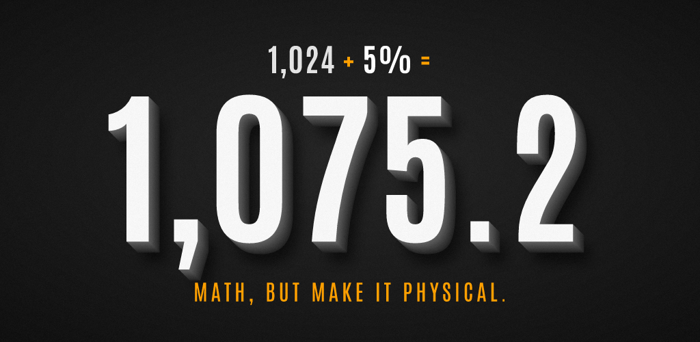
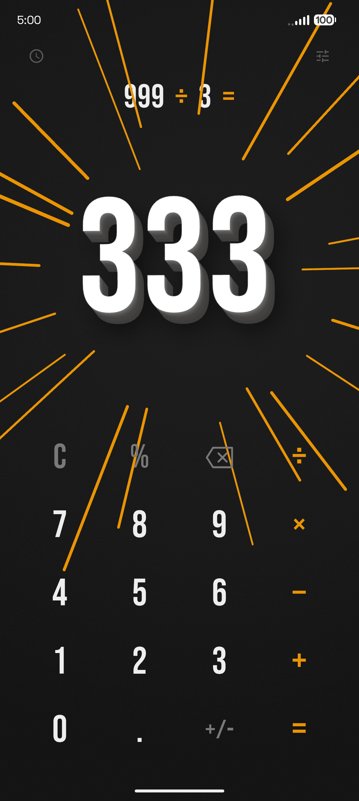
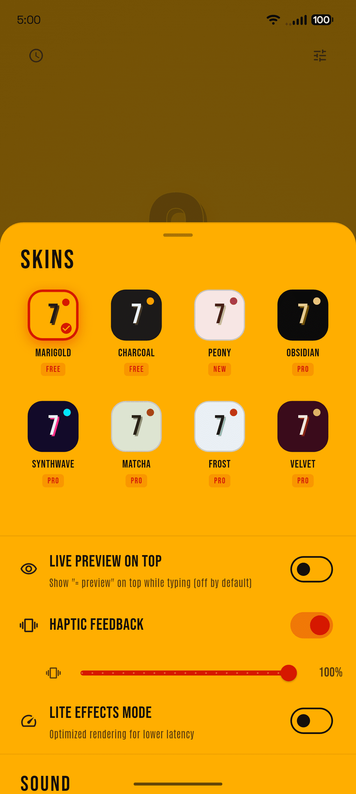
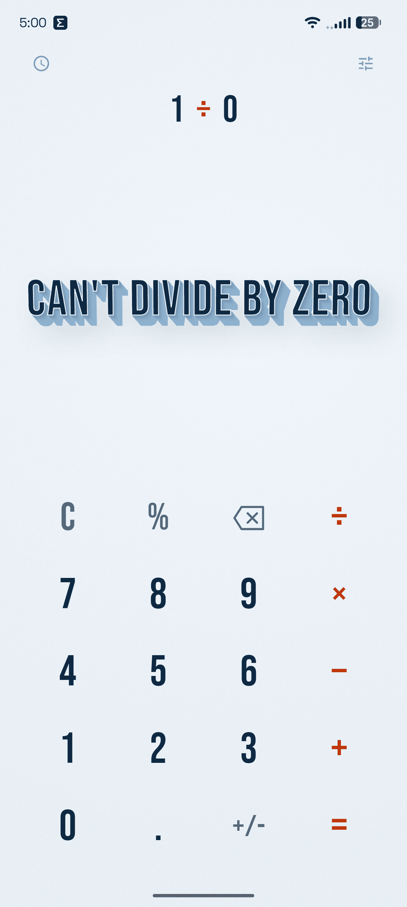
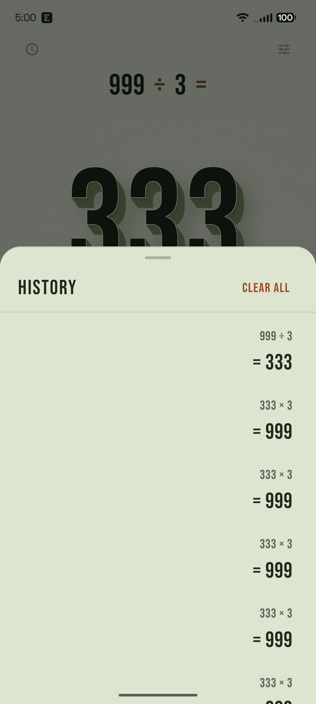

# PopCalc



**Math, but make it physical.**

PopCalc is an Android calculator with sculpted 3D numerals, tactile haptics, musical sound effects and eight hand-crafted skins.

- Version: 1.1.1
- Platform: Android
- Built with: Flutter
- 100% offline, no ads, no account, zero data collected

---

## Demo

<video src="https://github.com/ornobaadi/PopCalc/raw/main/assets/mockup.mp4" controls muted width="360"></video>

If the player doesn't load, [open the demo video](assets/mockup.mp4).

---

## Screenshots

<table>
  <tr>
    <td><br/>Charcoal: answer celebration</td>
    <td><br/>Marigold: skins and settings</td>
  </tr>
  <tr>
    <td><br/>Frost: error state</td>
    <td><br/>Matcha: history</td>
  </tr>
</table>

---

## Features

### 3D numerals and motion
- Extruded 3D numerals with bevelled edges, soft shadows and a subtle grain texture
- Tilt the phone or drag the number to shift it in 3D
- Digits rise and drop into place as you type
- A speed-line burst when the answer lands

### Haptics
- Native Android haptics with a different feel for each key type
- Heavier feedback on errors
- Adjustable haptic strength

### Sound
- Three sound packs: Pop, Mellow and Typewriter
- Number keys play a pentatonic melody as you type
- Plays alongside your music without pausing it

### Math
- Exact decimal arithmetic, so `0.1 + 0.2 = 0.3`
- Live preview of the answer while you type
- Tap any number or operator in the expression to edit it, and the answer updates instantly
- History restores the full expression so you can keep editing

### Privacy and performance
- Fully offline, with no internet permission
- No ads, no account, no data collected
- Lite Effects mode for low-end devices

---

## Skins

Each skin restyles the whole app: numerals, keys, sheets, celebration and status bar.

| Skin | Style | Background | Accent | Tier |
|---|---|---|---|---|
| Charcoal | Dark, white numerals, amber operators | `#141414` | `#FFA000` | Free |
| Marigold | Sunny gold and vermilion | `#FFAE00` | `#D61800` | Free |
| Peony | Blush petals, rose-quartz numerals | `#F7E6E4` | `#A8385E` | Free |
| Obsidian | Black lacquer and brushed gold | `#0B0B0C` | `#E8C877` | Pro |
| Synthwave | Retro-80s neon | `#120A2A` | `#00E5FF` | Pro |
| Matcha | Sage paper, ink and terracotta | `#DDE4D0` | `#A8431F` | Pro |
| Frost | Nordic ice, navy numerals | `#E8EFF5` | `#BF360C` | Pro |
| Velvet | Deep wine, cream and rose gold | `#3A0A1B` | `#E8A87C` | Pro |

Pro skins are free for everyone during launch. Nothing needed to do math will ever be locked.

---

## Join the closed beta

PopCalc is in closed testing on Google Play.

1. Join the Google Group: https://groups.google.com/g/popcalc
2. Opt in on the web: https://play.google.com/apps/testing/com.ornobaadi.popcalc
3. Install on Android: https://play.google.com/store/apps/details?id=com.ornobaadi.popcalc

Use the same Google account for all three steps. The Play Store listing can take a few minutes to appear after opting in.

Feedback and feature ideas are welcome in [Issues](https://github.com/ornobaadi/PopCalc/issues).

---

## How the math works

### Order of operations

Multiply and divide come before add and subtract. Operations at the same level run left to right.

```
1 + 2 × 3   →   7
8 ÷ 4 + 2   →   4
```

### Percent

| Input | Meaning | Example | Result |
|---|---|---|---|
| `a + b%` | `a + (a × b / 100)` | `1024 + 5%` | `1075.2` |
| `a − b%` | `a − (a × b / 100)` | `200 − 15%` | `170` |
| `a × b%` | `a × (b / 100)` | `80 × 25%` | `20` |
| `a ÷ b%` | `a ÷ (b / 100)` | `50 ÷ 25%` | `200` |
| `b%` | `b / 100` | `12%` | `0.12` |

### Edge cases

| Case | Behaviour |
|---|---|
| Divide by zero | Shows "Can't divide by zero"; the expression stays editable |
| Consecutive operators | The latest operator replaces the previous one |
| Leading zeros | `007` becomes `7` |
| Very large results | Scientific notation beyond 15 significant digits |
| Trailing zeros | `2.50` shows as `2.5` |
| Repeated `=` | Ignored, so no duplicate history entries |

---

## Project structure

```
lib/
├── core/
│   ├── engine/      # Pure-Dart math: Expression, Parser, Evaluator, Formatter
│   ├── audio/       # Sound packs (flutter_soloud)
│   ├── haptics/     # Native Android haptics via MethodChannel
│   ├── storage/     # Settings and history
│   └── theme/       # Skin colour tokens
└── features/
    ├── calculator/  # Controller, 3D numeral painter, keypad, animations
    ├── history/     # History sheet
    ├── settings/    # Skin picker and preferences
    └── splash/
```

- State management: Riverpod
- Math: `decimal` package, with no Flutter imports in the engine
- Sounds are generated by `tool/generate_sounds.py`

---

## Build from source

```bash
flutter pub get
flutter test
flutter run
```

Release builds:

```bash
flutter build appbundle --release
flutter build apk --release
```

---

## Platform

| | |
|---|---|
| Android | Supported |
| iOS | Planned |
| Orientation | Portrait |
| Network | None |
| Data collected | None ([privacy policy](docs/privacy-policy.html)) |

---

## License

- App source: MIT
- Fonts: Antonio and Bebas Neue, SIL Open Font License ([Antonio licence](assets/licenses/Antonio-OFL.txt))
- Sounds: procedurally generated, original to PopCalc

PopCalc is not affiliated with Google, Apple or Casio.
